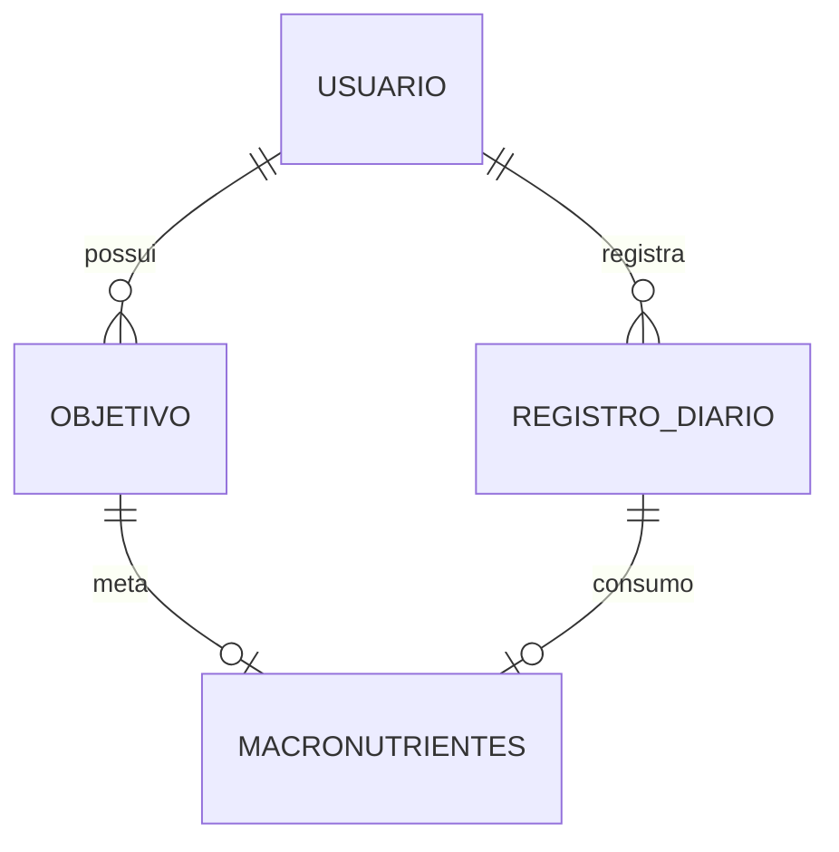

# 18. Modelo de dados

## 18.1 Modelo relacional

Quatro tabelas sustentam o backend: `usuario`, `objetivo`, `registro_diario` e
`macronutrientes`. A relação entre elas:



Um usuário tem muitos objetivos ao longo do tempo (cada recálculo cria um novo) e
muitos registros diários. Cada objetivo tem no máximo uma linha de macros do tipo
`meta`; cada registro diário tem no máximo uma linha de macros do tipo `consumo`. A
tabela `macronutrientes` é compartilhada pelos dois papéis — a subseção sobre a
terceira decisão de modelagem explica por quê.

### `usuario`

```
                                        Table "public.usuario"
     Column      |          Type          | Collation | Nullable |               Default
-----------------+------------------------+-----------+----------+-------------------------------------
 id              | integer                |           | not null | nextval('usuario_id_seq'::regclass)
 nome            | character varying(120) |           | not null |
 email           | character varying(255) |           | not null |
 sexo            | sexo                   |           | not null |
 data_nascimento | date                   |           | not null |
 altura_cm       | double precision       |           | not null |
Indexes:
    "usuario_pkey" PRIMARY KEY, btree (id)
    "usuario_email_key" UNIQUE CONSTRAINT, btree (email)
Check constraints:
    "ck_usuario_altura_valida" CHECK (altura_cm > 0::double precision AND altura_cm < 300::double precision)
```

(dump completo em `docs/backend/evidencias/schema-usuario.txt`)

### `objetivo`

```
                                     Table "public.objetivo"
     Column      |       Type       | Collation | Nullable |               Default
-----------------+------------------+-----------+----------+--------------------------------------
 id              | integer          |           | not null | nextval('objetivo_id_seq'::regclass)
 usuario_id      | integer          |           | not null |
 tipo            | tipo_objetivo    |           | not null |
 nivel_atividade | nivel_atividade  |           | not null |
 peso_kg         | double precision |           | not null |
 peso_meta_kg     | double precision |           |          |
 tmb_kcal        | double precision |           | not null |
 get_kcal        | double precision |           | not null |
 meta_kcal       | double precision |           | not null |
 data_inicio     | date             |           | not null |
 ativo           | boolean          |           | not null |
Indexes:
    "objetivo_pkey" PRIMARY KEY, btree (id)
    "ix_objetivo_um_ativo_por_usuario" UNIQUE, btree (usuario_id) WHERE ativo
    "ix_objetivo_usuario_id" btree (usuario_id)
Check constraints:
    "ck_objetivo_peso_positivo" CHECK (peso_kg > 0::double precision)
```

(dump completo em `docs/backend/evidencias/schema-objetivo.txt`)

### `registro_diario`

```
                                       Table "public.registro_diario"
    Column     |          Type          | Collation | Nullable |                   Default
---------------+------------------------+-----------+----------+---------------------------------------------
 id            | integer                |           | not null | nextval('registro_diario_id_seq'::regclass)
 usuario_id    | integer                |           | not null |
 data          | date                   |           | not null |
 peso_kg       | double precision       |           | not null |
 calorias_kcal | double precision       |           | not null |
 observacoes   | character varying(500) |           |          |
Indexes:
    "registro_diario_pkey" PRIMARY KEY, btree (id)
    "ix_registro_diario_usuario_id" btree (usuario_id)
    "uq_registro_diario_usuario_data" UNIQUE CONSTRAINT, btree (usuario_id, data)
Check constraints:
    "ck_registro_calorias_nao_negativas" CHECK (calorias_kcal >= 0::double precision)
    "ck_registro_peso_positivo" CHECK (peso_kg > 0::double precision)
```

(dump completo em `docs/backend/evidencias/schema-registro-diario.txt`)

### `macronutrientes`

```
                                       Table "public.macronutrientes"
       Column       |       Type       | Collation | Nullable |                   Default
--------------------+------------------+-----------+----------+---------------------------------------------
 id                 | integer          |           | not null | nextval('macronutrientes_id_seq'::regclass)
 tipo               | tipo_macro       |           | not null |
 objetivo_id        | integer          |           |          |
 registro_diario_id | integer          |           |          |
 proteina_g         | double precision |           | not null |
 carboidrato_g      | double precision |           | not null |
 gordura_g          | double precision |           | not null |
Indexes:
    "macronutrientes_pkey" PRIMARY KEY, btree (id)
    "ix_macro_consumo_unico_por_registro" UNIQUE, btree (registro_diario_id) WHERE tipo = 'consumo'::tipo_macro
    "ix_macro_meta_unica_por_objetivo" UNIQUE, btree (objetivo_id) WHERE tipo = 'meta'::tipo_macro
Check constraints:
    "ck_macronutrientes_discriminador" CHECK (tipo = 'meta'::tipo_macro AND objetivo_id IS NOT NULL AND registro_diario_id IS NULL OR tipo = 'consumo'::tipo_macro AND registro_diario_id IS NOT NULL AND objetivo_id IS NULL)
    "ck_macronutrientes_nao_negativo" CHECK (proteina_g >= 0::double precision AND carboidrato_g >= 0::double precision AND gordura_g >= 0::double precision)
Foreign-key constraints:
    "macronutrientes_objetivo_id_fkey" FOREIGN KEY (objetivo_id) REFERENCES objetivo(id) ON DELETE CASCADE
    "macronutrientes_registro_diario_id_fkey" FOREIGN KEY (registro_diario_id) REFERENCES registro_diario(id) ON DELETE CASCADE
```

(dump completo — o dump direto de `psql`, sem transcrição manual — em
`docs/backend/evidencias/schema-macronutrientes.txt`; imagem tipografada em
`docs/backend/evidencias/codigo-macronutrientes.png`, com o modelo SQLAlchemy que
produz este `CHECK`.)

### Três decisões de modelagem

**1. `data_nascimento` em vez de `idade`.** A idade é derivada em tempo de leitura
(`app/services/calculos.py::calcular_idade`), nunca armazenada como número. Um
número guardado envelhece incorretamente a partir do dia em que foi escrito; uma
data de nascimento não. A consequência prática é que dois usuários criados em datas
diferentes, mas com a mesma idade *na época*, mostram idades diferentes hoje — o
comportamento correto.

**2. Snapshot de `tmb_kcal`/`get_kcal`/`meta_kcal` em `Objetivo`.** Esses três
valores são calculados uma vez, em `POST /api/perfil/calcular`, e gravados como
estão — nunca recalculados na leitura. Isso preserva o histórico da prescrição: se
o usuário muda de peso ou de nível de atividade, o cálculo antigo continua sendo o
que foi de fato recomendado naquela data, e um novo `Objetivo` é criado para a
prescrição atual (o anterior é desativado, nunca apagado — ver `perfil_service.py`,
seção 22.2). A tabela `objetivo` acumula o histórico completo de prescrições de um
usuário.

**3. `Macronutrientes` com discriminador `tipo` (`meta` | `consumo`) em vez de duas
tabelas.** Esta é a decisão que mais rende na seção 22.2. Uma linha de
`macronutrientes` pertence a exatamente um dono — a um `Objetivo` (a prescrição) ou
a um `RegistroDiario` (o que foi de fato consumido naquele dia) — nunca aos dois. O
`CHECK ck_macronutrientes_discriminador` (visível no dump acima) é a garantia: o
banco, não a aplicação, impede que uma linha aponte para ambos ou para nenhum.

Por que uma tabela só, e não `macros_meta` + `macros_consumo`? Porque o comparativo
que `GET /api/diario/{usuario_id}` produz — cada dia registrado ao lado da meta
vigente — precisa juntar exatamente essas duas coisas. Com duas tabelas, essa
junção exigiria ou duas consultas com a junção feita em Python, ou um `UNION`
artificial só para reunir dois formatos idênticos. Com o discriminador, a consulta
é um único `LEFT OUTER JOIN`:

```sql
SELECT registro_diario.*, macronutrientes.*
FROM registro_diario
LEFT OUTER JOIN macronutrientes
  ON macronutrientes.registro_diario_id = registro_diario.id
 AND macronutrientes.tipo = 'consumo'
WHERE registro_diario.usuario_id = :id
ORDER BY registro_diario.data DESC
```

O detalhe que faz essa consulta funcionar é onde o predicado `tipo = 'consumo'`
mora: **no `ON`, nunca no `WHERE`**. `app/services/diario_service.py::resumo`
implementa exatamente isso (`and_(Macronutrientes.registro_diario_id == ...,
Macronutrientes.tipo == TipoMacro.CONSUMO)` dentro do `outerjoin`). T10 provou os
dois lados: com o predicado no `ON`, um dia sem linha de consumo aparece na lista
com macros zerados (o comportamento certo — o dia existe, só não foi registrado
consumo); movendo o mesmo predicado para o `WHERE`, o `LEFT OUTER JOIN` vira, na
prática, um `INNER JOIN`, e esse dia desaparece silenciosamente da lista.

A meta (`macros_meta`) é uma linha só — a mesma para todos os dias do usuário —
então vem de uma segunda consulta, independente do join, e é reaproveitada em
todas as linhas da resposta. Não é um segundo join por dia: é uma constante buscada
uma única vez. T10 mediu, não alegou: `GET /api/diario/{usuario_id}` dispara **4
SELECTs no total** (usuário, objetivo ativo, macros da meta, o join dos dias) e
esse número é **idêntico com 1 dia e com 10 dias** registrados. Não há N+1 — o
custo da consulta não cresce com o tamanho do histórico do usuário, que é
exatamente o que uma única tabela discriminada promete.

O preço dessa decisão é o `CHECK` mais complexo e os dois índices únicos parciais
(`ix_macro_meta_unica_por_objetivo`, `ix_macro_consumo_unico_por_registro`) — é o
banco, não a aplicação, que garante a relação 1:1 de cada `macronutrientes` com seu
dono.

## 18.2 Pipeline de persistência e validação

Toda escrita atravessa três camadas, cada uma barrando uma classe diferente de
problema:

| Camada | Onde | O que barra | Resposta |
|---|---|---|---|
| Pydantic | `app/schemas/` | tipo errado, faixa inválida (`peso_kg` fora de `(0, ∞)`, `altura_cm` fora de `(50, 250)`), enum inválido, data no futuro | 422 |
| Service | `app/services/` | usuário inexistente, objetivo ausente, meta calórica insuficiente para os macros mínimos | 404 / 422 |
| PostgreSQL | `app/models/` | `NOT NULL`, `UNIQUE`, `CHECK`, FK, o discriminador de `macronutrientes` | 409 |

Cada camada é a rede de segurança da anterior, não uma repetição dela: a camada
Pydantic não sabe se o usuário existe; o service não impede um `peso_kg` negativo
de chegar (isso já foi barrado antes); o banco não sabe que "meta calórica
insuficiente" é um erro de negócio — ele só sabe que um `CHECK` falhou.

`app/api/handlers.py::registrar_handlers` é o único lugar do backend que traduz
exceção em resposta HTTP — nenhum router tem `try/except`:

```python
@app.exception_handler(RecursoNaoEncontradoError)
async def nao_encontrado(request, exc): ...        # 404

@app.exception_handler(RegraDeNegocioError)
async def regra_violada(request, exc): ...          # 422

@app.exception_handler(ConflitoError)
async def conflito(request, exc): ...                # 409

@app.exception_handler(IntegrityError)
async def integridade(request, exc): ...              # 409, IntegrityError do SQLAlchemy
```

Uma exceção não mapeada (um `ValueError` vindo de `calculos.py`, um `KeyError` de
enum) vira 500 — deliberado: essas são bugs da aplicação, não respostas esperadas
de domínio.

### A transação: `get_db` comita uma vez, os services só fazem `flush()`

```python
def get_db() -> Generator[Session, None, None]:
    db = SessionLocal()
    try:
        yield db
        db.commit()
    except Exception:
        db.rollback()
        raise
    finally:
        db.close()
```

Há **uma transação por requisição**. O commit acontece uma vez só, no fim, depois
que o router e o service já terminaram de trabalhar. Dentro do service, cada
escrita é seguida de `db.flush()` — nunca de `db.commit()`.

**Por que isso importa mais do que parece — a regra dura medida por T7, T8 e T9:**
`flush()` envia o SQL ao banco e faz qualquer `CHECK`/`UNIQUE`/FK ser avaliado
*imediatamente*, ainda dentro do bloco `try` do service, antes de qualquer
resposta HTTP ter começado a ser construída. Sem o `flush()`, a mesma violação de
constraint só apareceria no `db.commit()` do `get_db` — que roda **depois** que o
router já devolveu o objeto de resposta ao Starlette. Nesse ponto a resposta já
está em trânsito; quando o `commit()` falha ali, o Starlette não tem mais como
trocar o corpo por um 409 estruturado e a requisição termina em **500**, com o
`IntegrityError` real escondido atrás de um erro genérico de servidor.

Por isso todo service que grava chama `db.flush()` logo após cada `db.add(...)` ou
mutação: `usuario_service.criar_usuario`, `perfil_service.calcular_e_salvar` (duas
vezes — ao desativar o objetivo anterior e ao inserir o novo objetivo/macros) e
`diario_service.registrar` (após gravar o registro e após gravar o consumo). O
comentário em cada um desses pontos no código não é decoração — é o registro da
medição que motivou a linha.

### O ponto que o próprio plano errou — e a documentação honesta disso

O *Self-Review* do plano original desta implementação afirmava que não havia risco
de divisão por zero em `aderencia_percentual` (`consumido_kcal / meta_kcal * 100`),
porque `calcular_macros` já falharia antes com "meta calórica insuficiente" se
`meta_kcal` chegasse a zero. **Essa alegação vale só para o caminho de escrita.**

T10 mediu o caminho de leitura: não existe `CHECK` sobre `objetivo.meta_kcal` na
tabela `objetivo` (o único `CHECK` da tabela, visível no dump acima, é
`ck_objetivo_peso_positivo` — sobre `peso_kg`, não `meta_kcal`). Um valor
`meta_kcal = 0` (ou negativo) é gravável diretamente no banco, fora do fluxo normal
da API, e o `GET /api/diario/{usuario_id}` levantava `ZeroDivisionError`, que virava
HTTP 500. A correção (F1 do handoff de T10) foi uma guarda explícita em
`diario_service.py::resumo`:

```python
if objetivo.meta_kcal <= 0:
    raise RegraDeNegocioError(
        f"objetivo {objetivo.id} tem meta_kcal invalida ({objetivo.meta_kcal}); "
        "nao ha como comparar consumo contra uma meta zero ou negativa"
    )
```

que devolve 422 em vez de 500. Uma segunda guarda equivalente (F2) cobre a linha de
`macros_meta` ausente, que produziria uma resposta internamente incoerente (meta
calórica real ao lado de macros `{0, 0, 0}`, como se essa fosse a prescrição).
Registrar isso aqui — em vez de reescrever o Self-Review como se ele sempre tivesse
estado certo — é o que torna esta seção prova, não propaganda: o plano errou nesse
ponto específico, o erro foi medido, e a correção ficou registrada tanto no código
quanto aqui.
