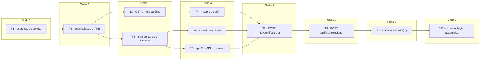
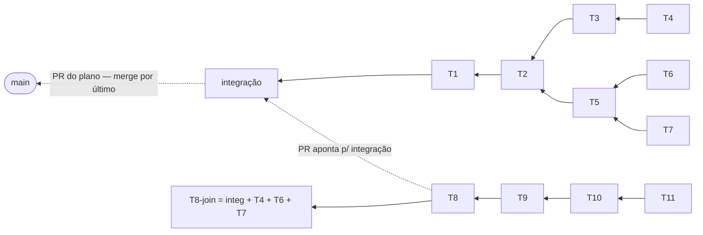

# Ciclo de execução — Backend Power Routine

Cronograma de execução do plano `2026-09-04-backend-power-routine.md`, produzido pelo
`/cadence:ship`. O plano diz **o que** construir; este documento diz **em que ordem** e
**onde cada PR se apoia**.

- **Slug:** `backend-power-routine`
- **Branch de integração:** `cadence/backend-power-routine-integration`
- **Plano:** `docs/superpowers/plans/2026-09-04-backend-power-routine.md`
- **Spec:** `docs/superpowers/specs/2026-09-04-backend-power-routine.md`

---

## Dependências e ondas

O plano é fortemente sequencial: T2→T3→T4 editam o mesmo `services/calculos.py`, T5→T6
os models, e T8→T9→T10 registram routers no mesmo `main.py`. O paralelismo real está em
duas bifurcações: `calculos.py` (T3, T4) roda ao lado da camada de banco (T5, T6, T7).



## Topologia de branches

Cada PR se apoia no branch do seu bloqueador — nenhuma task espera um merge. T8 tem três
bloqueadores, então recebe um **join branch** (integração + T4 + T6 + T7) para compilar
contra os três; o PR dela, ainda assim, aponta para a integração.



---

## Desvio de ambiente registrado

O plano manda instalar o PostgreSQL nativamente (`sudo apt install postgresql`). Nesta
máquina o servidor **não existe** — só o `postgresql-client-16`. O banco do ciclo roda
em container:

```bash
systemctl --user start docker-desktop
docker run -d --name power-routine-db --restart unless-stopped \
  -e POSTGRES_USER=power -e POSTGRES_PASSWORD=power -e POSTGRES_DB=power_routine \
  -p 5432:5432 -v power-routine-pgdata:/var/lib/postgresql/data postgres:16
docker exec power-routine-db psql -U power -d power_routine \
  -c "CREATE DATABASE power_routine_test OWNER power;"
```

As URLs de conexão do plano continuam válidas — o container publica a 5432 no host. A
**Task 11** deve documentar o container no `backend/README.md` em vez do `apt install`.
